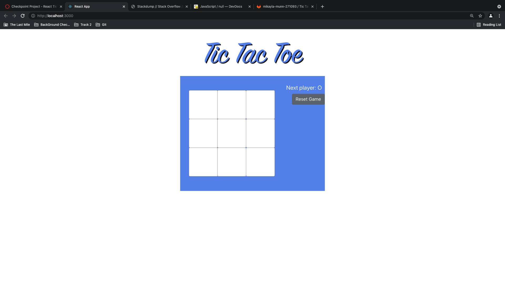
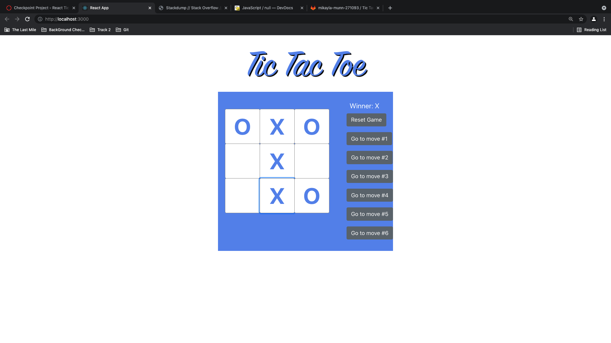

# Tic Tac Toe
Tic  Tac Toe is an interactive game from the user. The user and a friend can play together until one wins or there is a draw.

# Install 
___

Use the npm init to install the required libraries. <br>
```npm install```

## Requirements

---

You will need to install the following for the requirements in order for the program to work, if the ```npm install``` will not work for you.

> - react <br>
```npm install react```

> - react-dom <br>
```npm install react-dom```

> - react-scripts <br>
```npm install react-scripts```

> - react-bootstraps <br>
```npm install react-bootstrap```

> - babel-eslint <br>
```npm install babel-eslint@10.0.1```

> - coa <br>
```npm install coa@2.0.2```

## Description

  

This website contains a game called tic tac toe. In this game the user will be asked to click a square. If the user clicks the square, an "X" or "O". Then their friend will be allowed to click a square and have "X" or "O" pop up. 


  
The game will continue until one wins or there is a draw, meaning a tie. If the "X" wins, then the winner is "X" is displayed; same for "O".

There is also a reset button to reset the page to a blank game. In addition, the user can click the buttons generated after each move and see the moves happen.

## Roadmap

Some ideas for the future would be
> - Keeping the score for each one with wins ties and losses
> - Allowing the user's to add their names
> - Adding a leader board to shop who has the most wins.

## License
[MIT](https://choosealicense.com/licenses/mit/)

